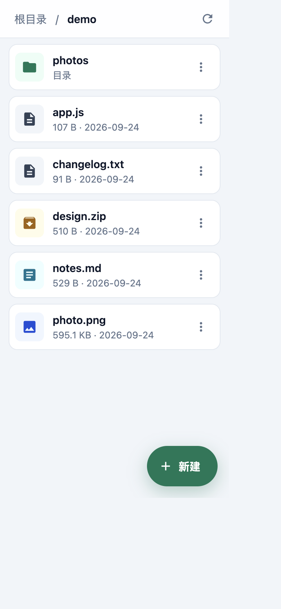
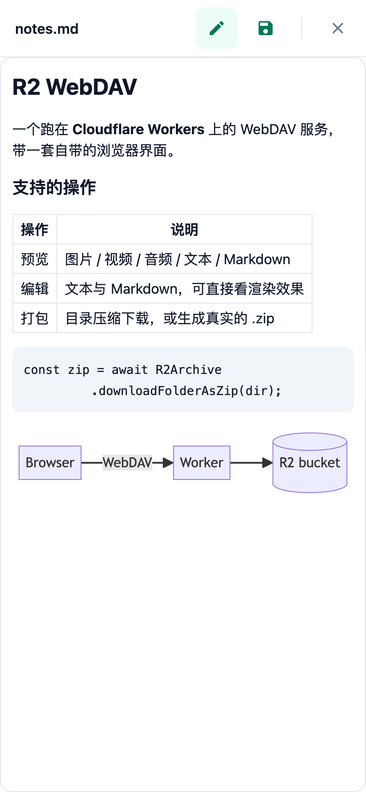

# r2-webdav

[](https://deploy.workers.cloudflare.com/?url=https://github.com/image72/r2-webdav)

把 **Cloudflare R2** 变成能挂载的网盘，同时自带一套能当 App 用的浏览器界面。

- **WebDAV**（DAV class 1, 2）：macOS Finder、rclone、各类 WebDAV 客户端都能直接挂载（本项目主要在 macOS Finder 上实测）
- **自带界面**：不装任何客户端也能浏览、上传、预览、编辑、打包；手机上就是一套顺手的文件管理器
- **没有常驻服务器**：整个服务跑在一个 Cloudflare Worker 上，文件存在 R2

> 改造自 [abersheeran/r2-webdav](https://github.com/abersheeran/r2-webdav)：协议层在此基础上修掉了大量互操作与数据完整性问题（逐条记录见 [docs/webdav-fix-list.md](docs/webdav-fix-list.md)），浏览器界面是重写的。上游仓库未声明许可证，如需再分发请自行确认。

## 界面

移动优先：手机浏览器上就是一套文件管理 App；桌面端是同一套页面，内容窄栏居中，预览 / 编辑改成右侧抽屉。

<p align="center">
  
  
  
</p>
<p align="center"><sub>目录列表 · 长按弹出操作面板 · 编辑器里直接「查看」渲染效果（表格、代码块、mermaid 都会渲染）</sub></p>

## 功能

### 浏览器界面

| 分组   | 能力                                                                                                                      |
| ------ | ------------------------------------------------------------------------------------------------------------------------- |
| 浏览   | 目录列表（目录优先、按类型着色）、面包屑、成员过多时明确提示而不是静默截断                                                |
| 上传   | 多选 / 拖拽整批上传；重名先问一次再覆盖；**同名目录直接拒绝**（目录的标记对象一旦被文件顶掉，里面的内容就会从列表里消失） |
| 新建   | 新建目录、新建文本文件；默认名自动避让已有条目，不会第二次就撞名                                                          |
| 整理   | 点标题改名（同目录 `MOVE`，显式 `Overwrite: F`，不会顺手删掉同名目标）、删除前二次确认                                    |
| 预览   | 图片 / 视频 / 音频 / 文本 / Markdown（markdown-it + mermaid）                                                             |
| 编辑   | 文本与 Markdown；编辑器里可直接「查看」渲染效果 —— 改一改、看一眼、再改，不必先保存；未保存时有标记                       |
| 打包   | 「压缩下载」在浏览器里打 zip 直接给你；「压缩为 zip」在当前目录生成真实的 `.zip` 对象；zip「解压」到同名目录              |
| 手势   | 长按（桌面端右键）弹出操作面板；操作带触感反馈                                                                            |
| 长任务 | 打包 / 解压有进度、随时可取消；失败或取消会把半成品清掉，不留垃圾对象                                                     |

<details>
<summary><b>WebDAV 层</b>：协议实现细节（DAV class 1, 2，以及被真实客户端逼出来的那些坑）</summary>

方法：`OPTIONS` `PROPFIND` `PROPPATCH` `MKCOL` `GET` `HEAD` `PUT` `DELETE` `COPY` `MOVE` `LOCK` `UNLOCK`（`DAV: 1, 2`）。

下面这些点基本都是被真实客户端逼出来的：

- **Range**：`GET`/`HEAD` 支持 `Range`，返回 `206` + `Content-Range`；只有真的返回片段时才带这个头（RFC 9110 §15.3.7 禁止在 200 上带）
- **条件请求**：`If-None-Match` / `If-Modified-Since` 分得清 `304` 和 `412`，缓存校验型客户端能正常拿到 304
- **Depth**：`0` / `1` / `infinity` 都实现，非法 Depth 回 `400`；集合的 `MOVE` 只接受 `infinity`
- **`MOVE` 默认 `Overwrite: F`**：与 RFC 的默认值相反，但 Finder / rclone 的"覆盖式改名"靠它
- **成员数超限回 `507`**：而不是"成功"地只处理前 3000 个（那会把剩下的变成看不见的孤儿）
- **隐式目录**：用 S3 接口直接写 `a/b/c.txt` 而从没建过 `a/` 时，列表里也会把它合成出来
- **路径**：按段做百分号解码，`my file.txt` 存进 R2 就是 `my file.txt`，不是 `my%20file.txt`
- **macOS 影子对象**：`._xxx`（AppleDouble）、`.DS_Store`、`.Spotlight-V100` 等，上传时丢弃、列表里隐藏
- **锁**：`LOCK`/`UNLOCK` 是真锁（状态落在单个 key `._locks` 上，不会被列表看到），但仍是 advisory —— `PUT`/`DELETE` 暂不强制校验锁令牌
- **截断可见**：列表被截断时带上 `X-WebDAV-Truncated: true`

</details>

## 快速开始（本地）

```bash
npm install

# 本地账号密码，wrangler dev 会读这个文件（已在 .gitignore 里）
printf 'USERNAME=admin\nPASSWORD=admin\n' > .dev.vars

npm run dev   # http://localhost:8787
```

本地 R2 走 wrangler 的本地模拟（默认 `.wrangler/`，也可以用 `--persist-to <dir>` 指定），不会碰到线上桶：

```bash
npx wrangler dev --port 8790 --persist-to /tmp/r2-webdav-dev
```

> ⚠️ **不要往本地挂载点里写文件**。本地 `wrangler dev` 从不响应 `Expect: 100-continue`，而 macOS Finder 的 `webdavfs` 发 `PUT` 时会先等这个 `100` 才开始发 body —— 于是文件会永久卡在上传中。这不是 Worker 的 bug（生产环境由边缘正常回 `100 Continue`），本地测试请用浏览器界面或 `curl`。

## 部署到 Cloudflare

### 1. 建一个 R2 桶

```bash
npx wrangler r2 bucket create webdav
```

### 2. 改 `wrangler.toml`

```toml
name = "r2-webdav" # Worker 名字，决定 workers.dev 域名

[[r2_buckets]]
binding = "bucket" # 保持这个名字：代码里按 bucket 取绑定
bucket_name = "webdav" # 换成你自己的桶名
```

### 3. 设置账号密码

```bash
npx wrangler secret put USERNAME
npx wrangler secret put PASSWORD
```

鉴权是 HTTP Basic：WebDAV 客户端和浏览器页面共用这一组账号密码（用 `timingSafeEqual` 比较）。目前没有多用户和权限区分。

### 4. 部署

```bash
npm run deploy # = wrangler deploy
```

部署后域名是 `https://<name>.<account>.workers.dev`。想换自己的域名：Cloudflare Dashboard → Workers → 选中该 Worker → 设置 → 域和路由 → 添加自定义域。**必须走 HTTPS**，Finder 之类的客户端不接受明文。

### 5. 挂载 / 连接

- **macOS Finder**：`⌘K` → `https://<host>/` → 输入账号密码
- **Windows**：映射网络驱动器 → `https://<host>/`（走系统的 WebClient 服务；本项目未在上面实测过）
- **rclone**：`rclone config` → 新建 webdav remote，vendor 选 `other`
- **不挂载**：浏览器直接打开 `https://<host>/` 就是自带界面

首次挂载会明显偏慢：Finder 会为每个条目额外发一次 `PROPFIND /._<name>` 探测属性。

### 部署时容易踩的坑

- **`[[rules]]` 的 glob 是按绝对路径匹配的**，所以只能写 `**/*.html` 这种形式。写成 `src/index.html` 永远不命中，构建时报的错是 `No matching export in "..." for import "default"`，看不出跟 glob 有关。
- `/_app/archive.client.js` 是**代码路由**（和页面同一个 Worker，由 `src/ui.ts` 直接吐出），R2 里不能有同名 key。
- `compatibility_flags = ["nodejs_compat"]` 和 `wrangler.toml` 里那两条 `[[rules]]` 都要保留。
- 打包 / 解压上限 80 MB，只改 `src/archive.client.js` 里的 `ZIP_BYTE_LIMIT` 一处即可。
- 浏览器端依赖 CDN：Alpine.js、JSZip、markdown-it、mermaid 全部从 jsdelivr 拉取；内网或离线部署需要把这些依赖一并自托管。

<details>
<summary><b>项目结构</b>：每个文件负责什么</summary>

```
src/index.ts             Worker 入口：Basic 鉴权、CORS、请求分发
src/webdav.ts            WebDAV 协议实现（唯一碰协议的地方）
src/ui.ts                页面层：目录列表 JSON、预览类型判断、静态资源分发
src/index.html           整个浏览器界面（HTML + CSS + 内联 Alpine 组件）
src/archive.client.js    浏览器端 zip 打包 / 解压（独立模块，可整个删掉，页面不受影响）
src/archive.client.d.ts  上面那个文件的类型声明（作为 Text 模块导入需要）
src/r2.ts                R2 访问工具：路径编解码、列表、并发控制、OS 元数据过滤
docs/webdav-fix-list.md  协议层的缺陷清单与修复记录
docs/screenshots/        README 用的截图
```

</details>

## 开发与检查

```bash
npm run format:check # prettier
npx tsc --noEmit     # 类型检查
```

几个改代码时会用到的约定：

- `src/index.html` 里的内联脚本是 Alpine 组件，`tsc` 看不到它的语法错误（模板字符串里的 JS），改完记得在浏览器里过一遍。
- `src/archive.client.js` 不引用页面状态，只通过 `{ onProgress, signal }` 与外界通信 —— 这样将来换成 Worker 或整个删掉，页面都不用动。
- `src/webdav.ts` 里每个偏离直觉的实现都写了"为什么"（RFC 条款 + 实测现象），改之前建议先读那段注释。

<details>
<summary><b>已知限制</b>：80 MB 打包上限、请求体 100/200 MB、advisory 锁、单目录 3000 项…</summary>

- **打包 / 解压都在浏览器里完成**（JSZip，上限 80 MB），Worker 只负责搬字节 —— 超大目录请分次处理。
- **单个目录最多列 3000 项**，超出会明确提示，未列出的部分需要用更具体的路径访问。
- **单次请求体有硬上限**：Cloudflare 限制 100 MB（Free/Pro）/ 200 MB（Business），而 WebDAV 没有标准的分片上传 —— 超过上限的大文件请改用 R2 的 S3 兼容 API（`createMultipartUpload`）。这和浏览器界面里 80 MB 的打包上限是两回事（那个是 JSZip 在内存里干活的限制）。
- **子请求与 CPU 配额**：Free 计划每次调用 1,000 个子请求（Paid 10,000），一次性 `COPY`/`MOVE` 要按成员逐个调 R2，规模一大就会得到 `507` —— 这是刻意的显式失败，不会静默丢数据。
- **并发连接**：Workers 每次调用最多 6 个等待响应头的连接，所以浏览器端打包 / 解压的并发度取 4。
- **锁是 advisory 的**：`LOCK`/`UNLOCK` 的状态和冲突判定是真的，但 `PUT`/`DELETE` 不强制要求锁令牌。
- **只有一组 Basic 账号密码**，没有多用户、权限、配额。
- 各客户端各自的脾气（Windows 资源管理器、Office、Finder 等）记录在 [docs/webdav-fix-list.md](docs/webdav-fix-list.md) 的「平台受限项」一节。

</details>

## 测试

协议层可以用 [litmus](https://github.com/notroj/litmus) 做合规性测试（本项目尚未跑完整套），真实客户端互操作（macOS Finder 挂载读写）的实测记录在 [docs/webdav-fix-list.md](docs/webdav-fix-list.md)。

## 致谢

- [abersheeran/r2-webdav](https://github.com/abersheeran/r2-webdav)：原始项目
- [Material Design Icons](https://github.com/google/material-design-icons)：界面图标（Apache-2.0）
