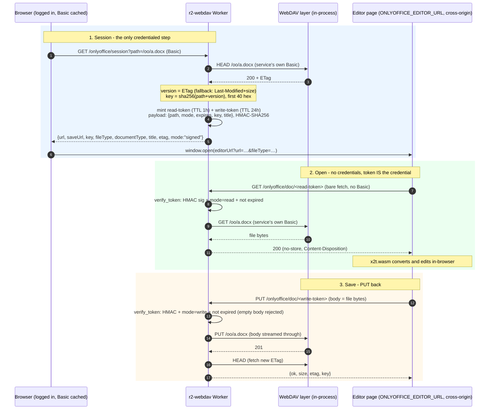

# ONLYOFFICE 打开 / 保存 adapter

给 [office-website](../../../office-website)（浏览器里跑 ONLYOFFICE 编辑器 + x2t WASM 转换的实例）
提供「打开」和「保存」两件事。**整块功能是可下线的**，见文末。

## 为什么是这个形状

那边没有 Document Server：编辑器、格式转换（x2t.wasm）、mock 文档服务器（`utils/editor/server.ts`）
全在浏览器里跑，所以 **没有** `document.url` 下载 + `callbackUrl` 回调那一套服务端流程。
代码里能看到的两个事实决定了本 adapter 的接口：

1. **打开**：`server.ts` 里是 `loader = (url) => fetch(url).then(res => res.arrayBuffer())`
   —— 一个**裸 fetch**，既不带 Basic 凭据，也加不了自定义头。所以取文件的 URL 必须自带凭证，
   而且只能是**短期签名 URL**。
2. **保存**：编辑结果最终是浏览器里的一个 `Blob`（`server.ts` 的 `downloadas` 分支里
   `new Blob([new Uint8Array(output)])`），它需要一个能接收字节的写入端点。

于是 adapter 只做两件事，不碰 `webdav.ts` / `r2.ts` / `index.html`：

```
office-website 编辑器页（浏览器，ONLYOFFICE_EDITOR_URL）   r2-webdav Worker
  │                                            │
  ├─ GET  /onlyoffice/session?path=/a.docx ───▶│  Basic 鉴权，换 token
  │◀── { url, saveUrl, key, fileType, … } ─────┤
  │                                            │
  ├─ GET  /onlyoffice/doc/<read-token>  ──────▶│  签名校验 → 以 WebDAV 客户端身份 GET
  │◀── 文件字节 ────────────────────────────────┤
  │   （x2t 在浏览器里转换、编辑）              │
  │                                            │
  ├─ PUT  /onlyoffice/doc/<write-token> ──────▶│  签名校验 → 以 WebDAV 客户端身份 PUT
  │◀── { ok, size, etag, key } ────────────────┤
```

adapter **不碰 bucket**：读写都构造成标准 HTTP 请求（`HEAD` / `GET` / `PUT` 到文件自己的 URL，
带上服务自身的 Basic 凭据），交给 WebDAV 协议层处理，等价于“一个有权限的 WebDAV 客户端”。
所以写入路径与其它客户端完全一致（父目录补建、影子文件过滤、PUT 前置条件都由 WebDAV 那层
负责），也不会绕过 WebDAV 的规则去动它背后的数据。

### 授权与读写全流程（签名模式）



### token 校验边界（明确不验证的东西）

`/onlyoffice/doc/<tok>` **只**校验三件事：HMAC 签名、`mode` 与路径匹配、`expires` 未过。
任何持 token 的一方（不论来自编辑器页面、`curl` 还是别的源）都能完成对应操作 —— token
本身就是这个端点的唯一凭据，与 `ONLYOFFICE_EDITOR_URL` 无绑定。

- 不校验 `Origin` / `Referer`：ONLYOFFICE 取文件是**服务端行为**，请求常不带这些头，
  校验了也拦不住不带头的 `curl`，只会误伤。
- `ONLYOFFICE_EDITOR_URL` 只在 `/onlyoffice/session`（Basic 环节）用来判断同源/直连，
  不参与 token 校验。
- 防泄漏靠时效（read 1h / write 24h）+ `Cache-Control: no-store` + 不把完整 token 打进日志。

这些请求由 `index.ts` 注入的 WebDAV 协议层函数在**进程内**执行，**不是** `fetch()` 自己的
hostname —— 生产环境下 Worker 自调用会被平台拦掉（实测返回 `404` + `error code 1042`），
而 `wrangler dev`（Miniflare）里完全看不出这个问题，只会在线上表现为「文件不存在」。

## 两种模式（靠 secret 自动切换，客户端接口一模一样）

上面那张图是**签名模式**。如果编辑器页面与 WebDAV **同源**，还可以不要 token：
两个 URL 直接就是文件自己的 WebDAV 地址（打开 = 原生 GET、保存 = 原生 PUT）——
同源请求浏览器的 `fetch()` 会自动补上已缓存的 Basic 凭据。

|                   | 直连（默认，不配 secret） | 签名（配了 `SIGNING_SECRET`）                 |
| ----------------- | ------------------------- | --------------------------------------------- |
| `url` / `saveUrl` | 文件自己的 WebDAV 地址    | `/onlyoffice/doc/<short-lived HMAC token>`    |
| 打开 / 保存       | 原生 `GET` / `PUT`        | adapter 校验签名后转发为 WebDAV `GET` / `PUT` |
| 授权              | 浏览器**已缓存的 Basic**  | 短链自带签名，不需要凭据                      |
| 前提              | **与 WebDAV 同源**        | 无（跨源可用）                                |

判断标准很硬，别凭直觉：`localhost:3000` 与 `127.0.0.1:8790`、`*.pages.dev` 与
`*.workers.dev` 都算**跨源**。跨源时裸 `fetch()` 不会带凭据，而我们的 CORS 是
`Access-Control-Allow-Origin: *` + `Allow-Credentials: false`，Basic 根本送不过去
（实测：带 `-u` 能取到文件，不带就是 `401`）。只有把编辑器页面挂到与 WebDAV
**同一个 host:port** 上，直连模式才成立。

## 端点

| 端点                        | 鉴权                   | 说明                                            |
| --------------------------- | ---------------------- | ----------------------------------------------- |
| `GET /onlyoffice/session`   | **Basic**（同 WebDAV） | `?path=/目录/文件.docx` → 换 token 与编辑器配置 |
| `GET /onlyoffice/doc/<tok>` | token（HMAC）          | 取文件字节（另有 `HEAD`）                       |
| `PUT /onlyoffice/doc/<tok>` | token（HMAC）          | 覆盖写回文件（body 就是文件本身；`POST` 等价）  |

`session` 的响应：

```json
{
	"fileType": "docx",
	"documentType": "word",
	"title": "report.docx",
	"key": "3f1c…（40 位十六进制，= sha256(path + ETag)）",
	"url": "https://<host>/onlyoffice/doc/<read-token>",
	"saveUrl": "https://<host>/onlyoffice/doc/<write-token>",
	"path": "/oo/report.docx",
	"size": 12345,
	"etag": "\"…\"",
	"readExpiresAt": 1699999999,
	"writeExpiresAt": 1699999999
}
```

- `key` 就是编辑器 `document.key`：同一版本稳定、内容一变就变（内容变了必须让编辑器重新下载，
  否则会继续用缓存里的旧内容）。
- `documentType` 取值 `word | cell | slide | draw | pdf`，与 office-website 的
  `utils/editor/types.ts` 里的 `DocumentType` 一致；`fileType` 是文件后缀。
- 只放行办公文档（docx/xlsx/pptx/odt/ods/odp/csv/txt/pdf/vsdx… 见 `src/onlyoffice.ts` 里的
  `EXTENSION_TYPES`），其它类型回 `415` 并列出支持的后缀。

### doc 端点的请求与响应

**打开**（office-website 编辑器页裸 fetch，无凭据）—— 响应体是**文件字节**，不是 JSON：

```bash
curl -s "$URL" -o /tmp/downloaded.docx   # GET：拉文件字节
curl -sI "$URL"                          # HEAD：只看 Content-Length / ETag
```

| 状态 | 含义                                             |
| ---- | ------------------------------------------------ |
| 200  | 文件字节（`Content-Type` 按 token 内扩展名给定） |
| 403  | token 无效 / 过期（读 TTL 1h）/ mode 不匹配      |
| 404  | token 有效，但文件已删除                         |

**保存**：消息体就是**编辑结果文件本身**（裸二进制，不是表单也不是 JSON），`PUT` 直发（`POST` 等价）：

```bash
curl -s -X PUT "$SAVEURL" \
	--data-binary @/tmp/b.docx \
	-H 'Content-Type: application/vnd.openxmlformats-officedocument.wordprocessingml.document'
```

- `Content-Type` 可省：adapter 按 token 里的路径扩展名自行补。
- 空消息体会被 `400` 拒绝（防把文件清成 0 字节）。

成功响应（office-website 编辑器页要刷新 config 时，`key` / `etag` 就拿这里的新值）：

```json
{
	"ok": true,
	"path": "/oo/a.docx",
	"status": 201,
	"size": 9,
	"etag": "\"…\"",
	"key": "3f1c…"
}
```

- `key` = sha256(path + etag)：内容一变就变。上游不给 ETag 时 `key` / `etag` 为 `null`。
- 失败：`400` 空 body、`403` 写 token 过期（TTL 24h）、`502` 上游 PUT 失败（响应里带具体状态码）。

## 启用

```bash
# 直连模式（编辑器与 WebDAV 同源）：什么都不用配

# 签名模式（跨源，例如 office-website 部署在 pages.dev、WebDAV 在 workers.dev）：
# 加一个密钥即可，客户端接口不变，不需要改任何调用代码。
# 这个密钥是所有浏览器在线服务（drawio、Photopea…）共用的，配一次就行。
npx wrangler secret put SIGNING_SECRET
```

可选：`EMBED_BASE_URL` —— 服务与 Worker 不同源、或前面挂了反代时，用它指定
对外暴露的基址（否则用请求的 origin 拼 URL）。

## 文件列表里的入口

再配一个编辑器页面地址，**r2-webdav 页面**的文件操作面板里就会出现「用 ONLYOFFICE 打开」（只对
办公文档显示，点了先向 r2-webdav Worker 要一份带签名短链的会话，再 window.open 打开
office-website 编辑器页）：

```toml
# wrangler.toml
[vars]
ONLYOFFICE_EDITOR_URL = "https://<editor-host>/editor"
```

- **打不开就不给入口**：地址没配、地址写错、或跨源但没配 `SIGNING_SECRET` 时，服务端干脆
  不注入配置，页面上那个按钮不会出现（不会给用户一个点了必然失败的按钮）。同源部署例外，
  那种情况直连模式本身可用。
- 放行的扩展名由 adapter 给（就是 `EXTENSION_TYPES`），前端不另维护一份。
- 配置是 `index.ts` 用 `HTMLRewriter` 注入到页面 HTML 的：`ui.ts` / `webdav.ts` 都不知道
  ONLYOFFICE 存在，下线时把 `index.ts` 里搜 `ONLYOFFICE` 的那几处删掉即可。

## 自测（不需要浏览器）

```bash
BASE=http://127.0.0.1:8790 ; AUTH=test:test

# 1. 先放一个文件进去（内容随便，这里只是造一个“已有文档”）
printf 'PK\003\004 v1' > /tmp/a.docx
curl -su $AUTH -T /tmp/a.docx $BASE/oo/a.docx

# 2. 换 token：响应是 JSON，用 node 抽出两个 URL（token 太长，别手抄）
SESSION=$(curl -su $AUTH "$BASE/onlyoffice/session?path=/oo/a.docx")
URL=$(node -e 'process.stdout.write(JSON.parse(process.argv[1]).url)' "$SESSION")
SAVEURL=$(node -e 'process.stdout.write(JSON.parse(process.argv[1]).saveUrl)' "$SESSION")

# 3. 打开（注意：不带 -u，模拟编辑器的裸 fetch）—— 响应体 = 文件字节
curl -s "$URL" | head -c 16 # → PK\003\004 v1

# 4. 保存：消息体 = 新文件本身，成功响应见上文「doc 端点的请求与响应」
printf 'PK\003\004 v2' > /tmp/b.docx
curl -s -X PUT --data-binary @/tmp/b.docx "$SAVEURL"
# → {"ok":true,"path":"/oo/a.docx","status":201,"size":9,"etag":"…","key":"…"}

# 5. 核对真的写回去了
curl -su $AUTH $BASE/oo/a.docx | head -c 16 # → PK\003\004 v2
```

## 接入 office-website（页面侧）

> 以下 1–3 已经在 office-website 里实现（`a73cecc` + `0894bf9`）；r2-webdav 侧
> `openInOnlyOffice` 会自动在编辑器页 URL 上追加 `&saveUrl=…`。这里保留原始步骤
> 作为接入其它宿主页面的参考。

1. 用 Basic 凭据调一次 `GET /onlyoffice/session?path=…`，拿到 `url / key / fileType / title / saveUrl`；
2. 打开编辑器页：`…/editor?url=<url>&saveUrl=<saveUrl>&fileType=<fileType>&fileName=<title>`
   —— 页面把 `url` / `saveUrl` 一起交给 `server.openUrl()`，编辑器对 `url` 做裸 `fetch`；
3. 保存语义（`utils/editor/server.ts` 的 `downloadas` 分支）：
   - **带了 `saveUrl`**：转换结果 `PUT` 到 `saveUrl`（`fetch(saveUrl, { method: 'PUT', body: blob })`）
     **即为保存**，不再触发本地下载；PUT 失败才退回本地下载兜底，错误通过
     `server.getSaveError()` 暴露，页面在 `onSave` 事件里读取并提示。
   - **没带 `saveUrl`**（upstream 默认场景，如 `?new=` 新建、纯前端打开）：行为不变，
     转换结果走本地下载（`<a download>`）。

跨域写在同源之外时会走 CORS 预检：`PUT` 本来就在 `Access-Control-Allow-Methods` 里，
预检由 WebDAV 那层的 `OPTIONS` 回答，无需额外配置。

## 安全模型

- **直连模式**：打开 / 保存就是普通 WebDAV GET/PUT，安全边界与 WebDAV 完全一致（Basic
  鉴权），adapter 只多提供一份「编辑器配置」（`key` / `documentType` / 两个 URL）。
  ⚠️ 代价：保存走原生 PUT，**空 body 会把文件覆盖成空** —— 页面侧要自己防（失败的
  空 Blob 不要发出去）。
- **签名模式**：`/onlyoffice/session` 是唯一入口（Basic 鉴权）；token 是 HMAC-SHA256
  签名的无状态凭证（`base64url(负载).base64url(签名)`，服务端不存会话），负载里带
  `path` / 读写方向 / 过期时间 / 版本 key；
- **写入路径只来自 token**：请求体、查询串都改不了目标文件，避开「callback 指哪写哪」那类漏洞；
- 读 token `TTL 1h`、写 token `TTL 24h` 分开；签名比较交给 `crypto.subtle.verify`（恒定时间）；
  密钥按 secret 缓存在 isolate 内；空 body 直接拒绝；
- 「URL 里放凭证」的固有代价是 TTL 内可重放 —— 所以读 token 只给 1 小时。**能同源部署就
  优先用直连模式**，连这个代价都没有。

## 已知限制（有意不做）

- **不做并发冲突检测**：不带 `If-Match`，同一文件的两次编辑按"最后写入者胜"。真要做应该是
  独立一轮功能，而不是塞进这个薄 adapter。
- **token 泄露窗口**：URL 里带凭证就有重放风险，所以 TTL 取短；要更严就得换成一次性 token +
  存储（那会让它重新变"重"）。
- **大文件全量传输**：`GET` 不支持 `Range` 续传，编辑器本来就是整份拉取；
  保存也是整份 PUT。
- **不做 ONLYOFFICE 服务端那套**：没有 `callbackUrl`（`status: 2/6`）实现 —— 目标实例不需要它。
  若将来改成真 Document Server，需要另加一个回调端点，并复用这里的 token/路径校验思路。

## 下线

1. 删 `src/onlyoffice.ts`；
2. `src/index.ts` 里搜 `ONLYOFFICE`，删掉三处接线（import、`Env` 里两个字段、鉴权旁路与分发那两行）；
3. 有 secret 的话 `npx wrangler secret delete SIGNING_SECRET`（如果还有别的在线服务在用它，就别删）。

其余代码（WebDAV、页面、归档）与它没有任何耦合。
